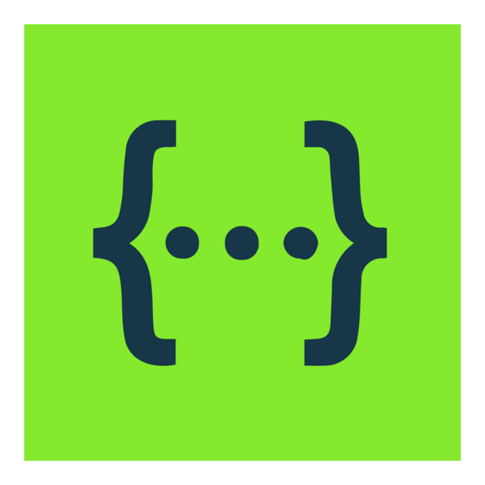

    
    <h3>Hi there!  I'm Anton 🤓
     Full Stack QA Engineer</h3>
    
Welcome to my GitHub 😺

    

 

 

    <h3>🧑‍💻 About me :</h3>
    
Full Stack QA Engineer  from Montenegro ⛰️ 🌅

    
Automation • Manual • Frontend • Backend • E2E • UI • API • Integration • Web • Mobile

    

    <ul style="list-style-type: disc; padding-left: 20px;">
        <li>🔭 I’m currently working on developing my skills in Automated Quality Assurance.</li>
        <li>🌱 I’m currently learning advanced concepts and tools for test automation.</li>
        <li>👯 I’m looking to collaborate on software testing projects and improving automation frameworks.</li>
        <li>🤔 I’m looking for help with mastering new testing tools and methodologies.</li>
        <li>💬 Ask me about anything related to test automation, QA processes, and software quality assurance.</li>
        <li>📫 How to reach me: see the <a href="#contacts">📍 Contacts</a> section.</li>
        <li>😄 Pronouns: He/Him.</li>
        <li>⚡ Fun fact: I'm a freediving instructor, sailing skipper and also I like traveling and outdoors activities.</li>
    </ul>

 

 

    <h3>⚙️ My tech stack :</h3>
    
🛠️ Languages & Tools

    <table>
        <tr>
            <!-- JavaScript -->
            <td align="center">
                <a href="https://developer.mozilla.org/en-US/docs/Web/JavaScript" target="_blank" style="text-decoration: none;">
                     
                </a>
                 
JavaScript

            </td>
            <!-- JavaScript -->
            <!-- TypeScript -->
            <td align="center">
                <a href="https://www.typescriptlang.org/" target="_blank" style="text-decoration: none;">
                     
                </a>
                 
TypeScript

            </td>
            <!-- TypeScript -->
            <!-- Playwright -->
            <td align="center">
                <a href="https://playwright.dev/" target="_blank" style="text-decoration: none;">
                     
                </a>
                 
Playwright

            </td>
            <!-- Playwright -->
            <!-- HTML -->
            <td align="center">
                <a href="https://developer.mozilla.org/en-US/docs/Web/HTML" target="_blank" style="text-decoration: none;">
                     
                </a>
                 
HTML

            </td>
            <!-- HTML -->
            <!-- CSS -->
            <td align="center">
                <a href="https://developer.mozilla.org/en-US/docs/Web/CSS" target="_blank" style="text-decoration: none;">
                     
                </a>
                 
CSS

            </td>
            <!-- CSS -->
        </tr>
        <tr>
            <!-- PostgresSQL -->
            <td align="center">
                <a href="https://www.postgresql.org/" target="_blank" style="text-decoration: none;">
                     
                </a>
                 
PostgreSQL

            </td>
            <!-- PostgresSQL -->
            <!-- SQL -->
            <td align="center">
                <a href="https://sql-page.com/documentation.sql" target="_blank" style="text-decoration: none;">
                     
                </a>
                 
SQL

            </td>
            <!-- SQL -->
            <!-- Swagger -->
            <td align="center">
                <a href="https://swagger.io/" target="_blank" style="text-decoration: none;">
                     
                </a>
                 
Swagger

            </td>
            <!-- Swagger -->
            <!-- Postman -->
            <td align="center">
                <a href="https://www.postman.com/" target="_blank" style="text-decoration: none;">
                     
                </a>
                 
Postman

            </td>
            <!-- Postman -->
            <!-- Kafka -->
            <td align="center">
                <a href="https://kafka.apache.org/" target="_blank" style="text-decoration: none;">
                     
                </a>
                 
Kafka

            </td>
            <!-- Kafka -->
        </tr>
        <tr>
            <!-- Kubernetes -->
            <td align="center">
                <a href="https://kubernetes.io/" target="_blank" style="text-decoration: none;">
                     
                </a>
                 
Kubernetes

            </td>
            <!-- Kubernetes -->
            <!-- Docker -->
            <td align="center">
                <a href="https://www.docker.com/" target="_blank" style="text-decoration: none;">
                     
                </a>
                 
Docker

            </td>
            <!-- Docker -->
            <!-- Elasticsearch -->
            <td align="center">
                <a href="https://www.elastic.co/elasticsearch" target="_blank" style="text-decoration: none;">
                     
                </a>
                 
Elastic

            </td>
            <!-- Elasticsearch -->
            <!-- CI/CD -->
            <td align="center">
                <a href="https://about.gitlab.com/topics/ci-cd/" target="_blank" style="text-decoration: none;">
                     
                </a>
                 
CI/CD

            </td>
            <!-- CI/CD -->
            <!-- Jenkins -->
            <td align="center">
                <a href="https://www.jenkins.io/" target="_blank" style="text-decoration: none;">
                     
                </a>
                 
Jenkins

            </td>
            <!-- Jenkins -->
        </tr>
    </table>

 

 

    <h3>🔥 My Stats :</h3>
    
      
    <a href="https://github-profile-summary-cards.vercel.app" target="_blank" style="text-decoration: none;">
        
          
        
        
         
        
        
    </a>
      
    

 

 

    <h3>📍 Contacts: </h3>
    
Get in touch <a href="#contacts" style="text-decoration: none;">@antondorovs</a> 👈

    <table align="center">
        <tr>
            <!-- Linkedin -->
            <td align="center">
                <a href="https://linkedin.com/in/antondorovs/" target="_blank" style="text-decoration: none;">
                     
                </a>
            </td>
            <!-- Linkedin -->
            <!-- Telegram -->
            <td align="center">
                <a href="https://t.me/antondorovs/" target="_blank" style="text-decoration: none;">
                     
                </a>
            </td>
            <!-- Telegram -->
            <!-- X -->
            <td align="center">
                <a href="https://x.com/antondorovs/" target="_blank" style="text-decoration: none;">
                     
                </a>
            </td>
            <!-- X -->
            <!-- GitHub -->
            <td align="center">
                <a href="https://github.com/antondorovs/" target="_blank" style="text-decoration: none;">
                     
                </a>
            </td>
            <!-- GitHub -->
            <!-- GitLab -->
            <td align="center">
                <a href="https://gitlab.com/antondorovs" target="_blank" style="text-decoration: none;">
                     
                </a>
            </td>
            <!-- GitLab -->
        </tr>
    </table>
    
My website: <a href="https://antondorovs.com/" target="_blank" style="text-decoration: none;">antondorovs.com</a>

    
My email: <a href="mailto:antondorovs@gmail.com" target="_blank" style="text-decoration: none;">antondorovs@gmail.com</a>

 

 

    <h3>✍️ Blog Posts :</h3>

    <ul style="list-style-type: disc; padding-left: 20px;">
        
BLOG-POST-LIST:START

        <li><a href="#blog" style="text-decoration: none;">Post 1 Coming soon...</a></li>
        <li><a href="#blog" style="text-decoration: none;">Post 2 Coming soon...</a></li>
        <li><a href="#blog" style="text-decoration: none;">Post 3 Coming soon...</a></li>
        
BLOG-POST-LIST:END

    </ul>

 

<!--
**antondorovs/antondorovs** is a ✨ _special_ ✨ repository because its `README.md` (this file) appears on your GitHub profile.

Here are some ideas to get you started:

- 🔭 I’m currently working on ...
- 🌱 I’m currently learning ...
- 👯 I’m looking to collaborate on ...
- 🤔 I’m looking for help with ...
- 💬 Ask me about ...
- 📫 How to reach me: ...
- 😄 Pronouns: ...
- ⚡ Fun fact: ...
-->
