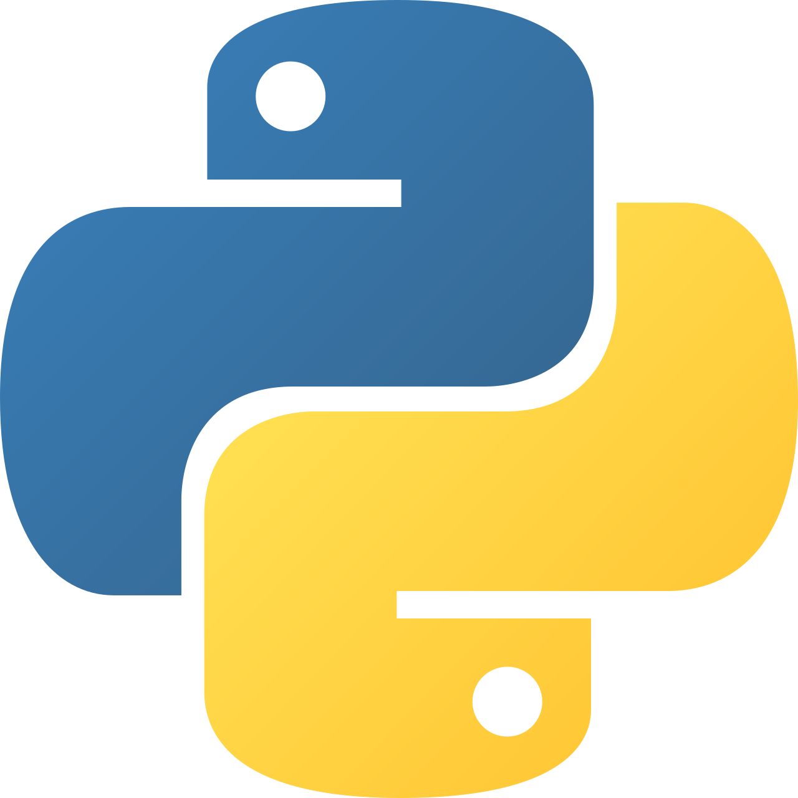

    <h3>Hi there!  I'm Anton 🤓
     a Full Stack QA Engineer</h3>
    
Welcome to my Git 🐱Hub & 🦊Lab space 🚀

    

 

    <h3>🧑‍💻 About me :</h3>
    
Full Stack QA Engineer  from Montenegro ⛰️🏞️🌅

    
Automation • Manual • Frontend • Backend • Web • Mobile • UI • API • E2E • Integration

    

<table align="center">
  <thead>
    <tr><th align="center"></th></tr>
  </thead>
  <tbody>
    <tr><td width="600">🔭 I’m currently working on developing my skills in Automated Quality Assurance.</td></tr>
    <tr><td>🌱 I’m currently learning advanced concepts and tools for test automation.</td></tr>
    <tr><td>👯 I’d like to collaborate on testing projects and improve automation frameworks.</td></tr>
    <tr><td>🤔 I’m looking for help with mastering new testing tools and methodologies.</td></tr>
    <tr><td>💬 Ask me about test automation, QA processes, and software quality assurance.</td></tr>
    <tr><td>📫 How to reach me: see the <a href="#contacts">Contacts</a> section.</td></tr>
    <tr><td>😄 Pronouns: He/Him.</td></tr>
    <tr><td>⚡ Fun fact: I'm a freediving instructor, sailing skipper and I like hiking and traveling.</td></tr>
    <tr><td></td></tr>
  </tbody>
</table>

 

    <h3>⚙️ My tech stack :</h3>
    
🛠️ Languages & Tools

<table align="center">
  <thead>
    <tr>
      <th align="center"></th>
      <th align="center"></th>
      <th align="center"></th>
      <th align="center"></th>
      <th align="center"></th>
    </tr>
  </thead>
  <tbody>
    <tr>
      <td align="center" width="120"> </td>
      <td align="center" width="120"> </td>
      <td align="center" width="120"> </td>
      <td align="center" width="120"> </td>
      <td align="center" width="120"> </td>
    </tr>
    <tr>
      <td align="center">JavaScript</td>
      <td align="center">TypeScript</td>
      <td align="center">Playwright</td>
      <td align="center">Python</td>
      <td align="center">Pytest</td>
    </tr>
    <tr>
      <td align="center" width="120"> </td>
      <td align="center" width="120"> </td>
      <td align="center" width="120"> </td>
      <td align="center" width="120"> </td>
      <td align="center" width="120"> </td>
    </tr>
    <tr>
      <td align="center">PostgreSQL</td>
      <td align="center">SQL</td>
      <td align="center">Swagger</td>
      <td align="center">Postman</td>
      <td align="center">Kafka</td>
    </tr>
    <tr>
      <td align="center" width="120"> </td>
      <td align="center" width="120"> </td>
      <td align="center" width="120"> </td>
      <td align="center" width="120"> </td>
      <td align="center" width="120"> </td>
    </tr>
    <tr>
      <td align="center">Kubernetes</td>
      <td align="center">Docker</td>
      <td align="center">Elastic</td>
      <td align="center">CI/CD</td>
      <td align="center">Jenkins</td>
    </tr>
  </tbody>
</table>

 

    <h3>🔥 My Stats :</h3>
    
      
    <a href="https://github-profile-summary-cards.vercel.app" target="_blank" style="text-decoration: none;">
        
          
        
        
         
        
        
    </a>
      
    

 

    <h3>📍 Contacts: </h3>
    
🌐 Website: <a href="https://antondorovs.com/" target="_blank" style="text-decoration: none;">antondorovs.com</a>

    
✉️ Email: <a href="mailto:antondorovs@gmail.com" target="_blank" style="text-decoration: none;">antondorovs@gmail.com</a>

    
👋 Connect with me: <strong>@antondorovs</strong>

<table align="center">
  <thead>
    <tr>
      <th align="center"></th>
      <th align="center"></th>
      <th align="center"></th>
      <th align="center"></th>
      <th align="center"></th>
    </tr>
  </thead>
  <tbody>
    <tr>
      <td align="center" width="120"> </td>
      <td align="center" width="120"> </td>
      <td align="center" width="120"> </td>
      <td align="center" width="120"> </td>
      <td align="center" width="120"> </td>
    </tr>
    <tr>
      <td align="center">Telegram</td>
      <td align="center">LinkedIn</td>
      <td align="center">X</td>
      <td align="center">GitHub</td>
      <td align="center">GitLab</td>
    </tr>
  </tbody>
</table>

 

    <h3>✍️ Blog Posts :</h3>

| |
| :--- |
| BLOG-POST-LIST:START |
| |
| 📝 <a href="#blog" style="text-decoration: none;">Post 1 Coming soon...</a> |
| 📝 <a href="#blog" style="text-decoration: none;">Post 2 Coming soon...</a> |
| 📝 <a href="#blog" style="text-decoration: none;">Post 3 Coming soon...</a> |
| |
| BLOG-POST-LIST:END |
| |

 

 

<!--
**antondorovs/antondorovs** is a ✨ _special_ ✨ repository because its `README.md` (this file) appears on your GitHub profile.

Here are some ideas to get you started:

- 🔭 I’m currently working on ...
- 🌱 I’m currently learning ...
- 👯 I’m looking to collaborate on ...
- 🤔 I’m looking for help with ...
- 💬 Ask me about ...
- 📫 How to reach me: ...
- 😄 Pronouns: ...
- ⚡ Fun fact: ...

    <ul style="list-style-type: disc; padding-left: 20px;">
-->
